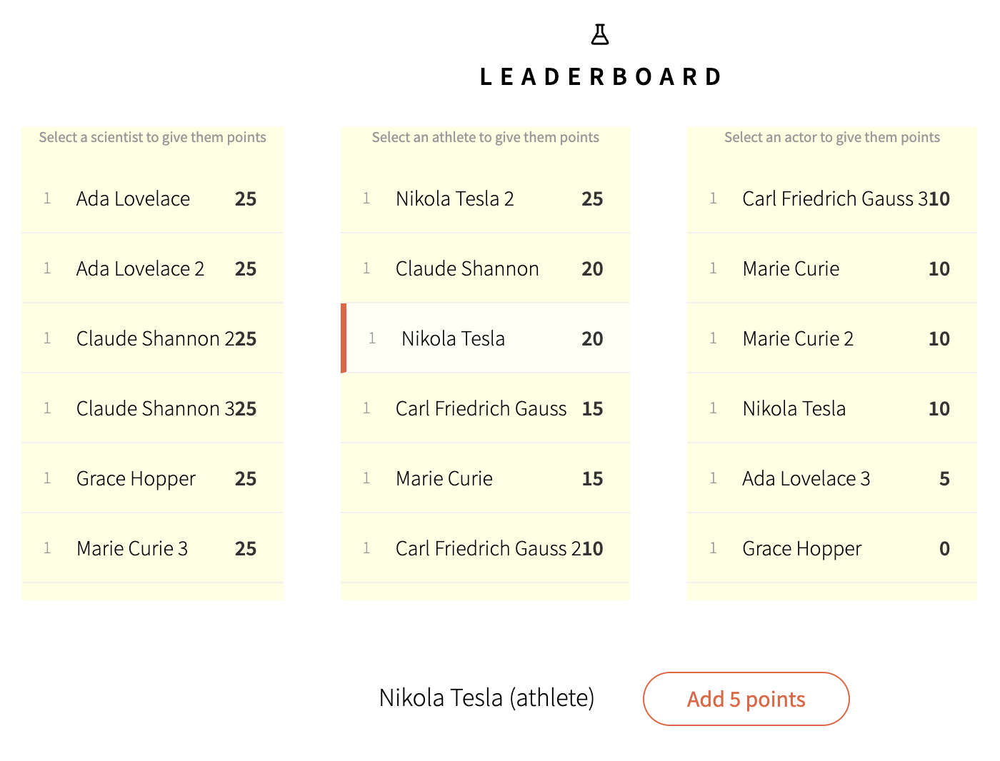

## 2. Meteor Componentization (BlazeJS)

Modify this Github repo: https://github.com/meteor/leaderboard to fulfill these requirements:

1. Reusable components.
2. Show 3 horizontal lists (Scientists, Athletes and Actors).
3. The main button should Add 10 points for Scientists, 5 points for Atheletes and 15 points for Actors.

Final result that we expect:

  

